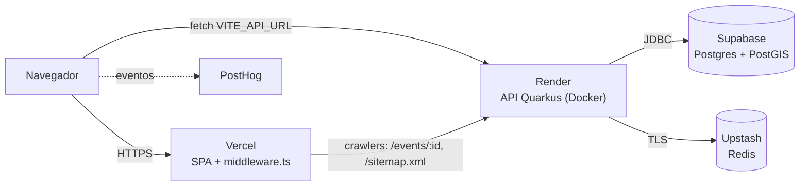

# Eventing

[](https://github.com/leonardomilv3/event/actions/workflows/workflow.yml)

Plataforma social para descobrir, criar e participar de eventos urbanos.
Interface "Living City": dark mode editorial com identidade noturna e vibrante.

**Produção:** https://event-ten-delta.vercel.app · **API:** https://eventing-api.onrender.com

## Sumário

- [Sobre o Eventing](#sobre-o-eventing)
- [Funcionalidades](#funcionalidades)
- [Stack e arquitetura](#stack-e-arquitetura)
- [Infraestrutura](#infraestrutura)
- [Pré-requisitos](#pré-requisitos)
- [Rodando localmente (passo a passo)](#rodando-localmente-passo-a-passo)
- [Rodando com Docker (stack completa)](#rodando-com-docker-stack-completa)
- [Variáveis de ambiente](#variáveis-de-ambiente)
- [Banco de dados](#banco-de-dados)
- [Testes](#testes)
- [CI/CD e deploy](#cicd-e-deploy)
- [Estrutura do repositório](#estrutura-do-repositório)
- [Como contribuir](#como-contribuir)
- [Problemas comuns (troubleshooting)](#problemas-comuns-troubleshooting)
- [Documentação adicional e licença](#documentação-adicional-e-licença)

---

## Sobre o Eventing

O Eventing conecta pessoas a experiências urbanas: shows, festas, encontros e eventos de bairro que hoje se espalham entre grupos de mensagem, perfis de rede social e agendas culturais. O produto junta essas peças num feed por proximidade com uma camada social (quem vai, quem você segue, link de convite).

O produto tem três arcos de uso:

- **Explorador**: descobre eventos por localização, categoria e curadoria social
- **Participante**: confirma presença, vê quem vai, compartilha o evento
- **Organizador**: cria, publica e gerencia eventos

**Status:** MVP em fase de discovery, já em produção. A infraestrutura é toda gerenciada (managed) de propósito nesta fase (ver [Infraestrutura](#infraestrutura)).

## Funcionalidades

O que está implementado no código hoje:

| Área | O que existe | Onde |
|---|---|---|
| Autenticação | Cadastro e login com e-mail/senha (bcrypt), JWT RS256 com validade de 24h, `GET /api/auth/me` | `api/.../auth`, `app/src/hooks/useAuth.ts` |
| Eventos | CRUD, rascunho → publicação (`POST /api/events/{id}/publish`), visibilidade `PUBLIC` / `PRIVATE` / `INVITE_ONLY`, data de término obrigatória, link da fonte opcional | `api/.../events` |
| Geolocalização | Feed por proximidade (`/api/events/feed`) e busca por raio até 50 km (`/api/events/nearby`) com PostGIS; autocomplete de endereço via Photon/OSM | `EventRepository`, `app/src/services/geocodingService.ts` |
| Cache | Feed e nearby cacheados no Redis (TTL 5 min); sitemap (TTL 1h) | `EventService`, `SitemapService` |
| Participação | Entrar/sair e lista de participantes em eventos **não públicos**, com limite de capacidade. Eventos `PUBLIC` não têm fluxo de participação | `api/.../participants` |
| Social | Seguir/deixar de seguir, listas de seguidores e seguindo | `api/.../social` |
| Perfil | Perfil próprio (ver/editar), perfil público (`/users/:userId`), "meus eventos" | `api/.../users` |
| Compartilhamento | Copiar link, share nativo, WhatsApp, X/Twitter, QR code (client-side); prompt de convite pós-confirmação | `app/src/hooks/useShareEvent.ts` |
| SEO / preview social | Middleware na Vercel injeta Open Graph/JSON-LD em `/events/:id` para crawlers e faz proxy de `/sitemap.xml` | `app/middleware.ts`, [ADR-011](docs/adrs/011-edge-prerender-og-seo.md) |
| Notificações | Lembretes por e-mail 24h e 1h antes do evento (scheduler a cada 15 min). **Desligado por padrão** (`NOTIFICATIONS_ENABLED=false`) | `api/.../notifications` |
| Analytics | PostHog (funil share → join, retenção, logs) + Vercel Analytics | `app/src/lib/`, [ADR-012](docs/adrs/012-posthog-funnel-analytics.md) |

Ainda **não funcionais** (só UI): recuperação de senha (`/forgot-password` não chama a API) e login social (botões exibem "Em breve").

Rotas do frontend: ver [`docs/routes.md`](docs/routes.md).

## Stack e arquitetura

| Camada | Tecnologia | Versão (do repositório) |
|---|---|---|
| Frontend | React + TypeScript + Vite | React 19.2, TypeScript ~6.0, Vite 8 (`app/package.json`) |
| Estilos | Tailwind CSS (v3 obrigatório, ver [ADR-003](docs/adrs/003-tailwind-css.md)) | 3.4 |
| Roteamento | React Router (`react-router-dom`) | 7.16 |
| Arquitetura front | Atomic Design: `pages → organisms → molecules → atoms` | [ADR-005](docs/adrs/005-atomic-design.md) |
| Backend | Java + Quarkus (REST Jackson, Hibernate ORM Panache, Hibernate Spatial) | Java 25, Quarkus 3.40.1 LTS (`api/pom.xml`, [ADR-010 backend](api/docs/adrs/010-java-25-quarkus-3-40.md)) |
| Migrations | Flyway | Versão do Quarkus BOM (12.x) |
| Auth | SmallRye JWT (RS256) | [ADR-002 backend](api/docs/adrs/002-smallrye-jwt.md) |
| Banco | PostgreSQL + PostGIS | `postgis/postgis:16-3.4` local |
| Cache | Redis | `redis:7.2-alpine` local, Upstash em prod |
| Arquitetura back | DDD leve por módulo (`auth`, `events`, `participants`, `social`, `users`, `notifications`, `seo`, `shared`) | [ADR-006 backend](api/docs/adrs/006-ddd-modular.md) |

Fluxo em produção:



O navegador fala direto com a API no Render; a Vercel só serve a SPA e, para crawlers, o middleware de SEO consulta a API. Detalhes em [`docs/architecture.md`](docs/architecture.md).

## Infraestrutura

### Produção (managed-first)

Escolha deliberada para a fase de discovery: custo próximo de zero e nenhuma operação de servidor. Justificativa em [ADR-008 (backend)](api/docs/adrs/008-managed-infrastructure-mvp.md).

| Serviço | Papel | O que roda lá |
|---|---|---|
| Vercel | Hospedagem do frontend | Build do Vite a cada push na `main` (integração Git da Vercel) + `app/middleware.ts` (Routing Middleware) |
| Render | Hospedagem da API | Container `leonardomilv3/eventing-api` puxado do Docker Hub, disparado por deploy hook |
| Supabase | Banco de dados | PostgreSQL + PostGIS |
| Upstash | Cache | Redis serverless com TLS |
| Docker Hub | Registry | Imagem da API (`leonardomilv3/eventing-api:1.1`) |
| GitHub Actions | CI/CD | Build do JAR, build/push da imagem, deploy hook do Render |
| PostHog | Analytics de produto | Funil, retenção, logs e exceções do frontend |
| SMTP | E-mail de lembretes | Provedor **a definir** (o código só lê `SMTP_*`; nenhum provedor está nomeado no repositório) |

### Local / desenvolvimento

`docker-compose.yml` sobe Postgres + PostGIS e Redis (e, opcionalmente, API e frontend; ver [Rodando com Docker](#rodando-com-docker-stack-completa)).

### Self-hosted: adiado, não esquecido

A migração para uma stack self-hosted open source (k3s, Traefik, Keycloak, MinIO, Vault) é uma decisão **adiada**, não descartada. Hoje os ADRs registram só pedaços dela: Keycloak foi descartado *para o MVP* ([ADR-002 backend](api/docs/adrs/002-smallrye-jwt.md)) e a "decisão futura" do [ADR-008](api/docs/adrs/008-managed-infrastructure-mvp.md) cita Fly.io/Railway antes de infra própria. Quando a migração entrar em pauta, registrar um novo ADR.

## Pré-requisitos

| Ferramenta | Versão | Origem |
|---|---|---|
| JDK | **25** | `maven.compiler.release=25` no `api/pom.xml`; imagens `eclipse-temurin-25`; CI com `java-version: '25'` |
| Maven | Use o wrapper `./mvnw` (baixa o Maven 3.9.15) | `api/.mvn/wrapper/maven-wrapper.properties` |
| Node.js | `^20.19.0` ou `>=22.12.0` | `engines` do Vite 8 e do ESLint 10 no `package-lock.json` |
| npm | O que vem com o Node acima | `package-lock.json` (use `npm ci`/`npm install`) |
| Docker + Docker Compose v2 | Qualquer versão recente com `docker compose` | `docker-compose.yml` |
| OpenSSL | Para gerar as chaves JWT | — |

> **JDK errado é o erro mais comum.** O projeto compila com `release 25`, então um JDK mais antigo (ex.: 21) falha na compilação com `release version 25 not supported`.
> Confira qual JDK o Maven Wrapper está usando antes de rodar o `./mvnw`:
>
> ```bash
> ./mvnw -v   # deve mostrar "Java version: 25..."
> export JAVA_HOME=/caminho/para/jdk-25   # se mostrar outra versão
> ```

## Rodando localmente (passo a passo)

Ordem: banco e cache no Docker, API e frontend na sua máquina.

### a) Clonar

```bash
git clone git@github.com:leonardomilv3/event.git
cd event
```

### b) Gerar as chaves JWT

A API assina e valida tokens com um par RSA. As chaves **não são versionadas**: `*.pem` está no `api/.gitignore` e `**/*.pem` no `api/.dockerignore`. Gere um par só seu, em `api/src/main/resources/` (os testes leem as chaves desse caminho no classpath):

```bash
cd api/src/main/resources
openssl genpkey -algorithm RSA -pkeyopt rsa_keygen_bits:2048 -out privateKey.pem
openssl pkey -in privateKey.pem -pubout -out publicKey.pem
cd -
```

Confira que o Git ignora os arquivos (a saída deve citar `api/.gitignore`):

```bash
git check-ignore -v api/src/main/resources/privateKey.pem
```

> Nunca use `git add -f` em `.pem`, nem copie as chaves para fora de `api/`.

### c) Subir Postgres e Redis

```bash
docker compose up -d postgres redis
```

Portas: Postgres em `5432` (banco/usuário/senha `eventing`, definidos no `docker-compose.yml`, só para uso local) e Redis em `6379`. Os avisos `The "JWT_PUBLIC_KEY" variable is not set` nesse comando são inofensivos: essas variáveis só importam para o serviço `api`.

### d) Rodar a API

A configuração em `application.properties` só define datasource, Flyway, Redis e JWT no perfil **`%prod`**. Não existe perfil `%dev`. Por isso a API roda localmente **com o perfil prod e variáveis de ambiente apontando para o compose**.

Na pasta `api/`, exporte as variáveis (valores locais do `docker-compose.yml`):

```bash
cd api
export DB_URL=jdbc:postgresql://localhost:5432/eventing
export DB_USER=eventing
export DB_PASSWORD=eventing          # senha local do docker-compose.yml, não é credencial real
export REDIS_URL=redis://localhost:6379
export CORS_ORIGINS=http://localhost:5173
export JWT_PUBLIC_KEY="$(cat src/main/resources/publicKey.pem)"
export JWT_PRIVATE_KEY="$(cat src/main/resources/privateKey.pem)"
```

Depois escolha **uma** das formas:

**Opção 1: JAR empacotado (igual à produção)**

```bash
./mvnw -B clean package -DskipTests
java -Duser.timezone=UTC -jar target/quarkus-app/quarkus-run.jar
```

`java -jar` ativa o perfil `prod` por padrão, e o Flyway aplica as migrations no startup (`%prod.quarkus.flyway.migrate-at-start=true`). O `-Duser.timezone=UTC` reproduz o `Dockerfile` ([ADR-009 backend](api/docs/adrs/009-utc-datetimes.md)). Swagger UI e Dev UI **não** estão disponíveis nesse modo; a especificação OpenAPI fica em `/q/openapi`.

**Opção 2: `quarkus:dev` (live reload)**

```bash
./mvnw quarkus:dev -Dquarkus.profile=prod
```

Atenção: `quarkus:dev` sempre roda em **modo de lançamento DEVELOPMENT** (o log mostra `Profile prod activated. Live Coding activated.`). O `-Dquarkus.profile=prod` troca só o *perfil de configuração*, e é ele que carrega as propriedades `%prod` (datasource, `migrate-at-start`, JWT). Sem ele:

- `./mvnw quarkus:dev` puro não encontra configuração de banco/Redis e tenta subir **Dev Services** (Testcontainers); o Flyway **não** migra (não há `%dev.quarkus.flyway.migrate-at-start`) e não há chaves JWT configuradas. Não use essa forma.

Neste modo, Swagger UI (`/q/swagger-ui`) e Dev UI (`/q/dev-ui`) ficam disponíveis, e o servidor escuta em `localhost:8080`.

### e) Rodar o frontend

```bash
cd app
cp .env.example .env.local   # .env.local é ignorado pelo Git (*.local)
# edite .env.local: VITE_API_URL=http://localhost:8080 e as variáveis do PostHog
npm install
npm run dev                  # http://localhost:5173
```

> Em `npm run dev`, `app/src/lib/posthog.ts` **lança erro** se `VITE_POSTHOG_KEY` ou `VITE_POSTHOG_HOST` estiverem vazias. Para desenvolver sem PostHog, mantenha os placeholders do `.env.example`: a inicialização passa e os eventos simplesmente não chegam a lugar nenhum.

O `app/middleware.ts` (SEO) **não** roda no `npm run dev`; para testá-lo, use `vercel dev` ou um preview deploy ([ADR-011](docs/adrs/011-edge-prerender-og-seo.md)).

### f) Confirmar que tudo funciona

```bash
# Health (Postgres + Redis devem aparecer como UP)
curl http://localhost:8080/q/health/ready

# Criar um usuário de teste (senha com no mínimo 8 caracteres; username de 3 a 50)
curl -X POST http://localhost:8080/api/auth/register \
  -H 'Content-Type: application/json' \
  -d '{"email":"dev@example.com","username":"devlocal","password":"<SENHA>"}'

# Login (devolve {"data":{"token":"..."}})
curl -X POST http://localhost:8080/api/auth/login \
  -H 'Content-Type: application/json' \
  -d '{"email":"dev@example.com","password":"<SENHA>"}'

# Feed por proximidade (parâmetros lat/lon)
curl 'http://localhost:8080/api/events/feed?lat=-15.79&lon=-47.88'
```

- Swagger UI: http://localhost:8080/q/swagger-ui (só na opção 2, `quarkus:dev`)
- Frontend: http://localhost:5173, faça login com o usuário criado acima

## Rodando com Docker (stack completa)

O `docker-compose.yml` define quatro serviços:

| Serviço | Porta no host | Observação |
|---|---|---|
| `frontend` | `3000` → nginx `80` | Build com `VITE_API_URL` (padrão `http://localhost:8080`) |
| `api` | `8080` | Perfil `prod`; espera Postgres e Redis ficarem healthy |
| `postgres` | `5432` | `postgis/postgis:16-3.4`, volume `postgres_data` |
| `redis` | `6379` | `redis:7.2-alpine`, volume `redis_data` |

As chaves JWT entram por **variável de shell exportada**: o compose lê `${JWT_PUBLIC_KEY}` e `${JWT_PRIVATE_KEY}` do ambiente. Gere as chaves ([passo b](#b-gerar-as-chaves-jwt)) e, na raiz do repositório:

```bash
export JWT_PUBLIC_KEY="$(cat api/src/main/resources/publicKey.pem)"
export JWT_PRIVATE_KEY="$(cat api/src/main/resources/privateKey.pem)"
docker compose up --build
```

Frontend em http://localhost:3000, API em http://localhost:8080 (o compose já define `CORS_ORIGINS=http://localhost:3000`).

```bash
docker compose logs -f api          # logs de um serviço
docker compose down                 # derruba os containers, mantém os dados
docker compose down -v              # derruba e APAGA os volumes (banco e Redis zerados)
```

> O build do frontend usa os arquivos `app/.env.*` presentes na pasta (o `app/.dockerignore` só exclui `.env`, `.env.local` e `.env.*.local`). Variáveis `VITE_*` entram no bundle **em tempo de build**, então mudar o valor exige `--build`.

## Variáveis de ambiente

### Backend (`api/src/main/resources/application.properties`)

| Variável | Obrigatória | Uso | Exemplo (placeholder) | Ambiente |
|---|---|---|---|---|
| `DB_URL` | Sim (prod) | JDBC do Postgres | `jdbc:postgresql://<HOST>:5432/<BANCO>` | local e prod |
| `DB_USER` | Sim (prod) | Usuário do banco | `<USUARIO>` | local e prod |
| `DB_PASSWORD` | Sim (prod) | Senha do banco | `<SENHA>` | local e prod |
| `REDIS_URL` | Sim (prod) | Host do Redis (`quarkus.redis.hosts`) | `redis://localhost:6379` / `redis://default:<TOKEN>@<HOST_UPSTASH>:6379` | local e prod |
| `JWT_PUBLIC_KEY` | Sim (prod) | Conteúdo PEM da chave pública (validação) | `"$(cat publicKey.pem)"` | local e prod |
| `JWT_PRIVATE_KEY` | Sim (prod) | Conteúdo PEM da chave privada PKCS#8 (assinatura) | `"$(cat privateKey.pem)"` | local e prod |
| `CORS_ORIGINS` | Sim | Origens liberadas no CORS (usada em todos os perfis) | `http://localhost:5173` | local e prod |
| `NOTIFICATIONS_ENABLED` | Não (padrão `false`) | Liga o scheduler de lembretes por e-mail | `true` | prod |
| `APP_URL` | Não (padrão `https://event-ten-delta.vercel.app`) | Base dos links em e-mails e no sitemap | `https://<SEU_DOMINIO>` | prod |
| `SMTP_HOST` | Se notificações ligadas (padrão `localhost`) | Servidor SMTP | `<SMTP_HOST>` | prod |
| `SMTP_PORT` | Não (padrão `587`) | Porta SMTP (STARTTLS obrigatório) | `587` | prod |
| `SMTP_USER` | Se notificações ligadas | Usuário SMTP | `<SMTP_USUARIO>` | prod |
| `SMTP_PASSWORD` | Se notificações ligadas | Senha SMTP | `<SMTP_SENHA>` | prod |
| `SMTP_FROM` | Não (padrão `noreply@eventing.app`) | Remetente | `<REMETENTE>` | prod |

Fora do perfil prod o mailer roda em modo mock (`quarkus.mailer.mock=true`). O issuer do JWT (`mp.jwt.verify.issuer`) está fixo no `application.properties`, não em variável.

### Frontend (build do Vite, prefixo `VITE_`)

| Variável | Obrigatória | Uso | Exemplo (placeholder) | Ambiente |
|---|---|---|---|---|
| `VITE_API_URL` | Sim | Base URL da API (`src/services/httpClient.ts`) | `http://localhost:8080` | local, Docker, Vercel |
| `VITE_POSTHOG_KEY` | Sim em dev (erro se vazia); opcional em build de prod | Token do projeto PostHog (`src/lib/posthog.ts`) | `<SUA_CHAVE_POSTHOG>` | local, Vercel |
| `VITE_POSTHOG_HOST` | Idem | Host da instância PostHog | `https://<HOST_POSTHOG>` | local, Vercel |

### Vercel: middleware de preview/SEO (`app/middleware.ts`, sem prefixo `VITE_`)

| Variável | Obrigatória | Uso | Fallback |
|---|---|---|---|
| `API_URL` | Não | API consultada pelo middleware para montar os metadados | `VITE_API_URL`, depois `https://eventing-api.onrender.com` |
| `SITE_URL` | Não | URL canônica usada em `og:url` / `canonical` | Origem da requisição |

## Banco de dados

- **Migrations:** Flyway, em `api/src/main/resources/db/migration/`, aplicadas no startup no perfil prod (`migrate-at-start=true`, `baseline-on-migrate=true`). Hibernate fica em `validate`: o schema vem só do Flyway ([ADR-004 backend](api/docs/adrs/004-flyway.md)).
- **Convenção de nome:** `V{n}__descricao_snake_case.sql` (ex.: `V9__require_event_ends_at.sql`). A última hoje é a **V9**.
- **Nunca edite uma migration já aplicada.** O Flyway valida o checksum e a API não sobe. Crie sempre a próxima `V{n+1}`.
- **PostGIS:** habilitado pela `V3__create_events.sql` (`CREATE EXTENSION IF NOT EXISTS postgis`); a imagem local `postgis/postgis` já traz a extensão. Queries espaciais usam native queries ([ADR-007 backend](api/docs/adrs/007-native-queries-postgis.md)).
- **Datas:** todo `LocalDateTime` é UTC ([ADR-009 backend](api/docs/adrs/009-utc-datetimes.md)).
- **RLS no Supabase:** a regra é que o acesso aos dados passe só pela API Quarkus, mas **não há script nem migration de RLS no repositório**. O estado das políticas no Supabase está **a definir/documentar**.

## Testes

### Backend

Os testes (`@QuarkusTest` + JUnit/Mockito) **não usam Testcontainers**: `api/src/test/resources/application.properties` conecta no Postgres e no Redis do compose (`localhost:5432` e `localhost:6379`) com Dev Services desligado, e lê as chaves JWT de `src/main/resources/*.pem`. Então, antes de testar:

1. Postgres e Redis rodando: `docker compose up -d postgres redis`
2. Chaves geradas ([passo b](#b-gerar-as-chaves-jwt))
3. JDK 25

```bash
cd api
./mvnw test                 # roda os testes
./mvnw -B clean verify      # build completo + testes + relatórios
```

> Os testes gravam dados no banco local `eventing` do compose.

**Cobertura (JaCoCo):** o relatório mesclado (testes JUnit puros + `@QuarkusTest`) fica em `api/target/site/jacoco/index.html`; o `quarkus-jacoco` também gera `api/target/jacoco-report/`. Medição em 2026-10-07: 200 testes passando, **94,6% de linhas e 77,7% de branches** (relatório mesclado). Meta de cobertura: **a definir**, porque não há meta registrada nem `jacoco:check` no `pom.xml`.

### Frontend

```bash
cd app
npm run lint     # ESLint
npm run build    # tsc -b (type check) + vite build
```

Os dois precisam passar sem erros antes de finalizar qualquer tarefa (ver [`CLAUDE.md`](CLAUDE.md)). Não há testes automatizados no frontend nem script `test` no `package.json`.

## CI/CD e deploy

Pipeline em [`.github/workflows/workflow.yml`](.github/workflows/workflow.yml), disparado em todo push na `main`:

1. **build-and-push**: Java 25 → `./mvnw -B clean package -Dmaven.test.skip=true` (**os testes não rodam no CI**) → confere o artefato → build e push de `leonardomilv3/eventing-api:1.1` no Docker Hub (`linux/amd64`).
2. **deploy-render**: chama o deploy hook do Render, espera 120 s e valida `https://eventing-api.onrender.com/q/health/live`.

O **frontend** não passa pelo Actions: a Vercel builda e publica a cada push na `main` pela integração Git.

Secrets do GitHub (environment `production`), só os nomes:

| Secret | Uso |
|---|---|
| `DOCKERHUB_USERNAME` | Login no Docker Hub |
| `DOCKERHUB_TOKEN` | Login no Docker Hub |
| `RENDER_DEPLOY_HOOK_URL` | Disparo do deploy no Render |

As variáveis de runtime da API (`DB_*`, `REDIS_URL`, `JWT_*`, `CORS_ORIGINS`, `SMTP_*`…) ficam configuradas no painel do Render, e as do frontend/middleware, no painel da Vercel.

**Rollback:** procedimento **a definir**. Restrições atuais: a tag da imagem é fixa (`1.1`) e é sobrescrita a cada push, então não dá para voltar para uma imagem anterior por tag; um rollback da API hoje depende do histórico de deploys no painel do Render ou de um revert na `main` seguido de novo pipeline. No frontend, a Vercel mantém os deployments anteriores no painel.

## Estrutura do repositório

```
.
├── api/                        # Backend Java 25 + Quarkus
│   ├── src/main/java/com/eventing/
│   │   ├── auth/ events/ participants/ social/ users/   # módulos de domínio
│   │   ├── notifications/      # scheduler + e-mails de lembrete
│   │   ├── seo/                # GET /sitemap.xml
│   │   └── shared/             # config, exceções, respostas paginadas
│   ├── src/main/resources/
│   │   ├── application.properties
│   │   └── db/migration/       # migrations Flyway V1..V9
│   ├── src/test/               # testes + application.properties de teste
│   ├── docs/adrs/              # ADRs do backend
│   └── Dockerfile              # build Maven + runtime eclipse-temurin:25-jre (+ curl)
├── app/                        # Frontend React + Vite
│   ├── src/                    # components/{atoms,molecules,organisms}, pages, hooks, services, lib, utils, types
│   ├── middleware.ts           # Vercel Routing Middleware (OG/SEO + sitemap)
│   ├── Dockerfile, nginx.conf  # imagem nginx usada pelo docker-compose
│   └── .env.example            # modelo de variáveis do frontend
├── docs/                       # Documentação do frontend + ADRs do frontend
├── .claude/                    # Agentes, checklists e templates do Claude Code
├── .github/workflows/          # Pipeline de CI/CD
├── docker-compose.yml          # Stack local
├── CLAUDE.md                   # "Constituição" do projeto: regras para pessoas e agentes de IA
├── notes.md                    # Backlog bruto de ideias de produto (não é especificação)
└── LICENSE                     # MIT
```

`stitch_eventing/` (design exportado do Stitch, fonte de verdade visual) é **ignorado pelo Git** (`*stitch*` no `.gitignore`), então não vem num clone novo. Peça o export a quem mantém o projeto.

Arquivos que parecem desatualizados (mantidos, sinalizados para revisão):

- `notes.md`: lista de ideias de 2025; a maior parte não foi implementada.
- `app/README.md`: README padrão do template Vite.
- `app/README.docker.md`: descreve deploy no Azure Container Apps, que não é usado (produção é Vercel + Render).

## Como contribuir

### Fluxo de branch, PR e commits

- **Branches e PRs:** fluxo **a definir**. Não há template de PR nem regra escrita; o CI roda só em push na `main`, e todo push na `main` publica em produção.
- **Commits:** convenção **a definir**. O histórico usa o formato `tipo(escopo): descrição` (ex.: `feat(events): ...`, `fix(dates): ...`), mas isso não está documentado como regra.
- Antes de concluir qualquer mudança: checklists em [`.claude/checklists/`](.claude/checklists/) (feature, UI e release review).

### Convenções de código

- **Frontend:** Atomic Design com dependência unidirecional `pages → organisms → molecules → atoms`; TypeScript strict, sem `any`, `import { type Foo }` (por causa do `verbatimModuleSyntax`); só Tailwind, com tokens de `tailwind.config.ts`; mobile first. Regras completas em [`CLAUDE.md`](CLAUDE.md) e [`docs/architecture.md`](docs/architecture.md).
- **Backend:** um pacote por domínio com `controller` → `service` → `repository` → `domain`/`dto` ([ADR-006 backend](api/docs/adrs/006-ddd-modular.md)); datas em UTC ([ADR-009 backend](api/docs/adrs/009-utc-datetimes.md)).
- **Analytics:** eventos de funil só via `track()` de `app/src/lib/analytics.ts`, nunca `posthog.capture` direto.

### Onde registrar decisões

- Decisões implícitas/menores: [`docs/decisions.md`](docs/decisions.md).
- Decisões de frontend com maior impacto: novo ADR em [`docs/adrs/`](docs/adrs/) (template em [`.claude/templates/adr-template.md`](.claude/templates/adr-template.md)), indexado em `docs/adrs/README.md` e no `CLAUDE.md`.
- Decisões de backend/infra: [`api/docs/adrs/`](api/docs/adrs/).

### Receitas

- **Nova migration:** crie `api/src/main/resources/db/migration/V{próximo}__descricao.sql`, suba a API (perfil prod) e confirme no log `Successfully applied`. Se mexer em entidade, lembre que o Hibernate está em `validate`.
- **Novo endpoint:** siga um módulo existente (ex.: `social/`: controller com `@Path`, `@RolesAllowed("user")` nas rotas autenticadas, service, repository) e adicione testes em `api/src/test/java/com/eventing/<módulo>/`.
- **Novo componente/página:** confira o inventário em [`docs/components.md`](docs/components.md) antes de criar; para rotas, veja [`docs/routes.md`](docs/routes.md); templates em [`.claude/templates/`](.claude/templates/).

### Trabalhando com Claude Code

O projeto usa agentes especializados em [`.claude/agents/`](.claude/agents/). Cada um lê um subconjunto da documentação e cobre um foco específico:

| Agente | Quando usar |
|---|---|
| `architecture-agent` | Onde colocar um componente, revisar hierarquia, evitar duplicação |
| `react-engineer` | Implementar componente, hook, página ou rota |
| `design-system-guardian` | Qualquer mudança visual (tokens, tipografia, glassmorphism, responsividade) |
| `qa-agent` | Revisão antes de merge, acessibilidade, edge cases |
| `documentation-agent` | Depois de mudança estrutural: atualizar `docs/`, ADRs, `CLAUDE.md`, README |
| `api-backend-agent` | Endpoint, service, repository, entidade, migration, debug Java |
| `database-agent` | Migrations Flyway, queries PostGIS, performance de consulta |
| `api-integration-agent` | Chamadas HTTP no frontend, hooks que consomem a API |
| `devops-agent` | docker-compose, Dockerfiles, variáveis de ambiente, containers |

Tabela de "qual agente para qual tarefa" e regras do que os agentes não podem fazer: [`CLAUDE.md`](CLAUDE.md#ai-agents).

## Problemas comuns (troubleshooting)

| Sintoma | Causa | Solução |
|---|---|---|
| Build falha com `release version 25 not supported` | JDK abaixo do 25 no `JAVA_HOME` | `export JAVA_HOME=<jdk-25>` e confira com `./mvnw -v` |
| `./mvnw quarkus:dev` tenta subir containers (Dev Services) ou não cria tabelas | Não há perfil `%dev`; datasource e Flyway só existem em `%prod` | Use `./mvnw quarkus:dev -Dquarkus.profile=prod` com as variáveis exportadas, ou o JAR ([passo d](#d-rodar-a-api)) |
| `Port 8080 seems to be in use by another process` | Outra instância da API, ou o serviço `api` do compose rodando | `ss -ltnp \| grep 8080`; pare o processo ou `docker compose stop api` |
| `Redis host not configured - you must either configure 'quarkus.redis.hosts'` ao subir em prod | `REDIS_URL` ausente (o health check do Redis está ligado em prod) | Defina `REDIS_URL` (local: `redis://localhost:6379`) |
| Container `api` nunca fica `healthy` e o `frontend` não sobe | O healthcheck do compose usa `curl` dentro da imagem, e a `eclipse-temurin:25-jre` não traz `curl` | O `api/Dockerfile` instala `curl` no runtime; não remova essa etapa ao mexer na imagem (ou ajuste o `healthcheck` do `docker-compose.yml`) |
| Flyway/Hibernate falham conectando no Supabase | Pooler errado | Use o **Session pooler** (porta `5432`), não o Transaction pooler, para Flyway e Hibernate |
| Primeira requisição à API demora ou o preview social sai genérico | Cold start do Render no plano gratuito (~30 s, ver ADR-008); o middleware desiste após 8 s (ADR-011) | Esperado no MVP; repita a requisição |
| Frontend em dev quebra com `VITE_POSTHOG_KEY variable required by PostHog is missing` | Variáveis do PostHog vazias | Preencha `app/.env.local` (os placeholders do `.env.example` bastam) |

## Documentação adicional e licença

| Documento | Conteúdo |
|---|---|
| [`CLAUDE.md`](CLAUDE.md) | Regras do projeto, stack, agentes, checklist obrigatório |
| [`docs/architecture.md`](docs/architecture.md) | Stack, estrutura de pastas, princípios, convenções |
| [`docs/design-system.md`](docs/design-system.md) | Cores, tipografia, espaçamento, animações, tokens Tailwind |
| [`docs/routes.md`](docs/routes.md) | Rotas, layouts e seções de cada página |
| [`docs/components.md`](docs/components.md) | Componentes: props e responsabilidades |
| [`docs/development-workflow.md`](docs/development-workflow.md) | Scripts, build, checklist pré-merge |
| [`docs/decisions.md`](docs/decisions.md) | Decisões arquiteturais e seus porquês |
| [`docs/adrs/`](docs/adrs/README.md) | ADRs do frontend (001–013) |
| [`api/docs/adrs/`](api/docs/adrs/README.md) | ADRs do backend (001–010) |

Licença: [MIT](LICENSE).
